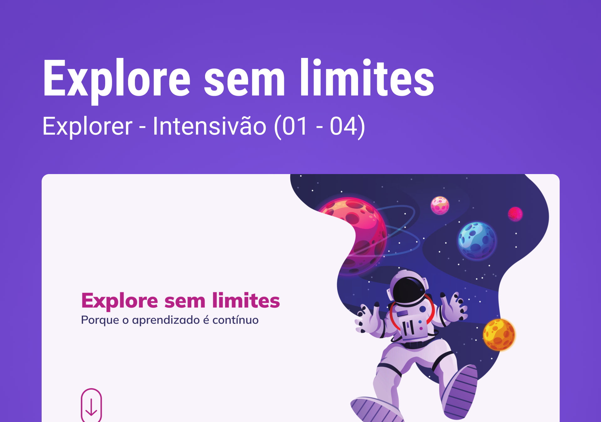

<h1 align="center">Intensivão  Explore sem limites </h1>

  <a href="#-tecnologias">Tecnologias</a>&nbsp;&nbsp;&nbsp;|&nbsp;&nbsp;&nbsp;
  <a href="#-projeto">Projeto</a>&nbsp;&nbsp;&nbsp;|&nbsp;&nbsp;&nbsp;
  <a href="#-layout">Layout</a>&nbsp;&nbsp;&nbsp;|&nbsp;&nbsp;&nbsp;
  <a href="#memo-licença">Licença</a>

  

 
  

  
  
   

## 🚀 Tecnologias

Esse projeto foi desenvolvido com as seguintes tecnologias:

- HTML 
- CSS
- Git e Github
- Figma

## 💻 Projeto

  O Desafio Intensivão é uma criação de uma Landing-Page para fortalecer nosso conhecimento sobre alguns conceitos aprendidos em aula na Rocketseat, entre eles:

  <ul>

  <li>Display flex</li>
  <li>Unidade de Medida Flexível</li>
  <li>Variáveis</li>
  <li>Animações</li>
  <li>Transições e Transformações</li>
  <li>Media Queries</li>

  </ul>
      
 

- [Visite o projeto online]()

 

## 🔖 Layout

Você pode visualizar o layout do projeto através [DESSE LINK](https://www.figma.com/file/Tdks1xfGKTuQnVHuuFsYbI/Explore-sem-limites-(Copy)?type=design&node-id=2-10958&t=slS6IAqW0AeZXZu4-0). É necessário ter conta no [Figma](https://figma.com) para acessá-lo. 

  

## :memo: Licença

Esse projeto está sob a licença MIT.

---

Feito com ♥ by Iara Marques :wave: [Participe da comunidade da RocketSeat!](https://discord.gg/rocketseat)